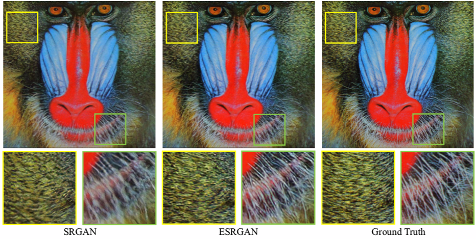
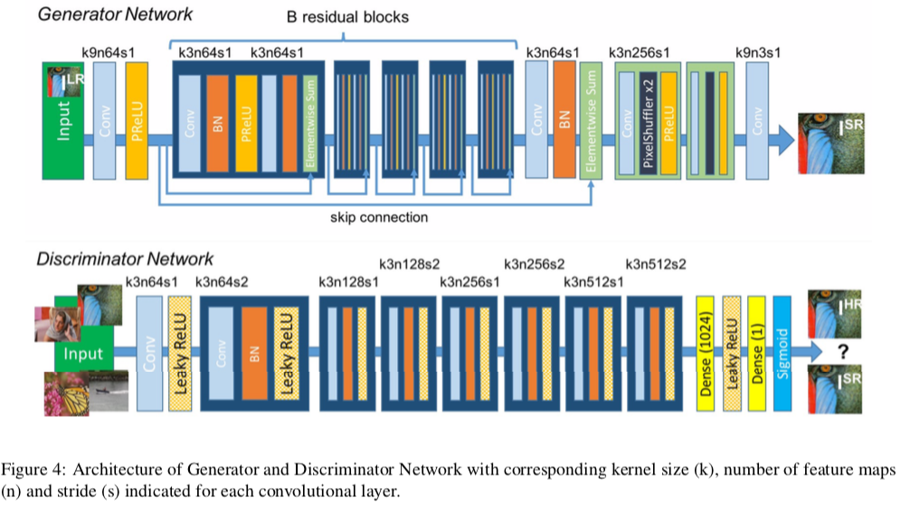
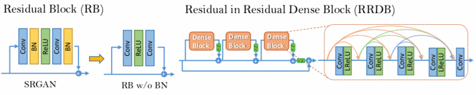
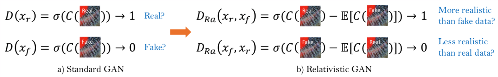

#  The Summary of ESRGAN
Paper link: https://arxiv.org/abs/1809.00219
Github link: https://github.com/xinntao/ESRGAN
## Overview
This ESRGAN is enhanced version of pervious SRGAN, which figure out unpleasant artifacts in SRGAN.ESRGAN is capable                                                                                                                                                                                                                                                                                                                                                                                                                                                                                                                                                                                                                                                                                                                                                                                                                                                                                                                                                                                                                                                                                                                                                                                                                                                                                                                                                                    of generating more detailed structure while others fail to produce details.

## Three key components

ESRGAN come up with three points from **network architecture, adversarial loss, perceptual loss**.

 - Introduce the Residual-in-Residual Dense Block (RRDB) without batch normalization as the basic network building unit. RRDB is higher capacity and easier to train 
 - Borrow the idea from relativistic GAN to let the discriminator predict relative realness instead of the absolute value
 - Improve the perceptual loss by using the features before activation, which could provide stronger supervision for brightness consistency and texture recovery.

## Previous model
So many networks has impoved SR performance, especially **Peak Signal to Noise Ratio** value. The **drawback** is: since PSNR metric fundamentally disagree with the **subjective evaluation of human observers**, these PSNR-Oriented approcaches(SRCNN) tend to output **over-smoothed results** without sufficient **high-frequency details**.
In order to solve this problems which caused by PSNR-Oriented approcaches, **Perceptual-driven methods** have been proposed to improve the visual quality of SR results. The main contribution of those perceptual-driven methods is that **Perceptual loss**. **Perceptual loss** is proposed to optimize super-resolution model in a **feature space** instead of **pixel space**. SRGAN is milestones, which recovered texture details by further incorporated **semantic image prior**. The architecture of SRGAN is: residual blocks and optimized using perceptual loss in a GAN framework.

## The drawbacks of SRGAN

## Improve the SRGAN by three aspects

 - First, improve the network structure by introducing the Residual-in-Residual Dense Block, which is easier to train. Also **remove BN layers**. From the paper we can know that removing BN can **save** the computational resources and memory usage. Futhermore, when a network is deeper and more complicated, the model with BN layer is more likely to introduce unpleasant artifacts.
 - Second, Using  **Relativistic average GAN** can let **generator** recover more realistic texture details. **Relativistic average GAN** is learning to judge **whether one image is more realistic than the other** rather than **whether one image is real or fake**. Befor we talk RD, we should know what is GAN's discriminator.The standard discriminator D in SRGAN, which estimates the probability that one input images **x** is real and natural.**But** for RD, it predict the probability that a real image x_r is relativistic **more realistic** than a fake one x_f
 - Third, they propose an improved perceptual loss by **using the VGG features before activation** instead of **after activation as in SRGAN**. They empirically find that this way can provide sharper edges and more visually pleasing results.

##  Details of ESRGAN 
###  Network Architecture
####  Generator G

 - remove all BN
 - Replace the original basic block with RRDB, which combines **multi-level residual network and dense connections**

####  Residual in Residual Blocks
We keep the high-level architecture design of SRGAN and use a novel RRDB because based on observation that more **layers** and **connections** could always **boost performance**. RRDB employs a **deeper and more complex structure** than the original RB in SRGAN.RRDB use dense block in the main path, this way can make the network capacity becomes higher benefiting from the **dense connections**

### Relativistic discriminator

From the diagram we can see that standard discriminator in SRGAN can be expressed as $D(x)=\sigma (C(x))$,where $\sigma$ is the sigmoid function and $C(x)$ is the **non-transformed discriminator output**. Then the RaD formulated as $$D_{Ra}(x_{r},x_{f})=\sigma(C_{x_{r}})-E_{xf}[C(xf)]$$ where $E_{xf}[*]$ represents the operation of taking average for all fake data in the mini-batch.

 - The discriminator loss is then defind as :
 $$L_{D}^{Ra} = -E_{xr}[log(D_{Ra(x_{r},x_{f})})]-E_{xf}[log(1-D_{Ra}(x_{f},x_{r}))]$$
 - The adversarial loss for generator is in a symmetical form
 $$ L_{G}^{Ra} = -E_{xr}[log(D_{Ra}(x_{r},x_{f}) - E_{xf}[log(1 - D_{Ra}(x_{f},x_{r}))]$$
From those equotion above we can observe $x_{f} = G_{x_{i}}$ and $x_{i}$ is input $LR$ image. It is observed that in adversarial loss for generator contains **both** $x_{r}$ and $x_{f}$.**Therefore** , RA generator benefits from the gradients from both **generated data and real data in adversarial training**, but in SRGAN we can see that only generated part takes effect
This RD is not only to **increase** the probability that generated data are real, but also to simultaneously **decrease** the probability that real data are real.(enhance SRGAN by using RAGAN) 
###  Perceptual loss
#### Unlike SRGAN
constraining on features after activation, this way can cause many drawbacks
 - the activated features are very sparse, especially after a very deep network, **the sparse activation** can provides weak supervision and thus leads to inferior performance.
 - Using the activation also causes inconsistent reconstructed brightness compared with GT
#### ESRGAN develop an effective perceptual loss. 
$L_{percep}$ use features before activation layers. This way can overcome two drawback as I mentioned above
Therefor the tota loss for the **generator** is
$$ L_{G} = L_{percep} + \lambda L_{G}^{Ra} + \eta L_{1}$$
where $L_{1} = E_{x_{i}}\left \| G(_{x_{i}})-y \right \|_{1}$ is the **content loss** that evaluate the **1-norm** distance between **recovered image** $G_{x_{i}}$ and the **ground-truth** $y$, and $\lambda$, $\eta$ are the coefficients to balance different loss terms
Instead of using perceptual loss that adpots a VGG network trained for image classification. ESRGAN adopt **SR - MINC** loss,which based on fine-tuned VGG and focuses on **textures rather than object**
###  Network Interpolation
####  Two merits
 - Interpolated model can produce meaningful results for any feasible $\alpha$ without introducing artifacts.
 - Balance perceptual quality and fidelity without re-training the model

This strategy can solve unpleasant noise in GAN based methods.
 - Train a PSNR-oriented network $G_{PSNR}$
 - Then obtain a GAN-based network $G_{GAN}$ by fine-tuning.
 - Important last is **interpolate** all parameters of these two networks to **derive** an interpolated model **$G_{INTERP}$**
$$\theta _{G}^{INTEPR} = (1 - \alpha )\theta_{G}^{PSNR} + \alpha \theta_{G}^{GAN}$$
where $\theta _{G}^{INTEPR}$, $\theta_{G}^{PSNR}$, $\theta_{G}^{GAN}$ are the parameters of $G_{INTEPER}$, $G_{PSNR}$ and $G_{GAN}$, and $\alpha \in [0,1]$ is the interpolation parameter.
##  Experiments
###  Training Details
 - Obtain $LR$ images by down-sampling $HR$ imagesusing Bicubic kernel function.
 - mini-batch size is set to 16 (larger patch size has larger receptive field which help to capture more semantic information)
###  Training process
####  Training stages
 - First, train a PSNR-oriented model with L1 loss
 - Then trained a PSNR-oriented model as an **initialization for the generator** ，this generator  is trained using the loss function is $L_{G} = L_{percep} + \lambda L_{G}^{Ra} + \eta L_{1}$ (with $\lambda=5*10^{-3}$ and $\eta=1*10^{-2}$) and the learning rate is set to $1*10^{-4}$ and halved at [50K,100K,200k,300K] iterations.
 Pre-training with pixel-wise loss helps GAN-based methods to obtain more pleasing results
 Beacuse : 
	 - It can avoid undesired local optima for the generator
	 - after pre-training, the discriminator receives relatively good super-resolved images instead of extreme fake ones(black or noisy images) at the very begining, which helps it to focus more on texture discrimination

####  Optimization
Using Adam with $\beta _{1}^ =0.9$ ,$\beta _{2}^=0.999$. They alternately update the generator and discriminator network until the model converages
###  Dataset
####  Training dataset
 - DIV2K dataset (high-quality 2K resolution)
 - Flickr2K dataset
####  Testing dataset
 - Set5
 - Set14
 - BSD100
 - Urban100
 - PIRM self-validation dataset

 

## Trick for training
 - Residual Scaling: scaling down the residuals by multiplying a constant between 0 and 1 **before** adding them to the main path to **prevent instability**
 - Smaller Initialization: If the **initial parametre variance** becomes smaller, the **residual architecture** is easier to train.
### Remove BN layers
 BN layers can introduce unpleasant **artifacts** and limit the **generalization ability**  as well as increase **computational complexity**. The reason is that 

 - BN layers normalize the features using **mean**  and **variance** in a batch during training and use **estimated mean** and variance of the whole training dataset during testing.
 - They Empirically ovserve that BN layers are more likely to bring artifacts when the network is **deeper** and **trained under GAN**

These artifacts occasionally appear among **iterations** and **different settings** . So remove BN can help to training and consistent performance.

### Aditional Knowledge
#### Perceptual loss 
Perceptual loss is proposed to enhance the **visual quality** by  minimizing the error in a **feature space instead of pixel space** 
#### Contextual loss 
Contextual loss is developed to generate images with natural image statistics by using an **objective** that focuses on the **feature distribution** rather than merely **comparing the appearance**
#### Spatial feature Transform
SFT effectively incorporate **semantic prior** in an image and improve the recovered textures. 
#### The disadvantage of PSNR and SSIM
So many SR algorithms are evaluated by several **distortion measures** :PSNR and SSIM. But those metrics disagree with the **subjective evaluation of human ovservers**. So, which methods are suitable?---Ma's score and NIQE (Non-reference measures) are suitable for **perceptual quality evalution**

perceptual index
residual scaling
perception-distortion 
